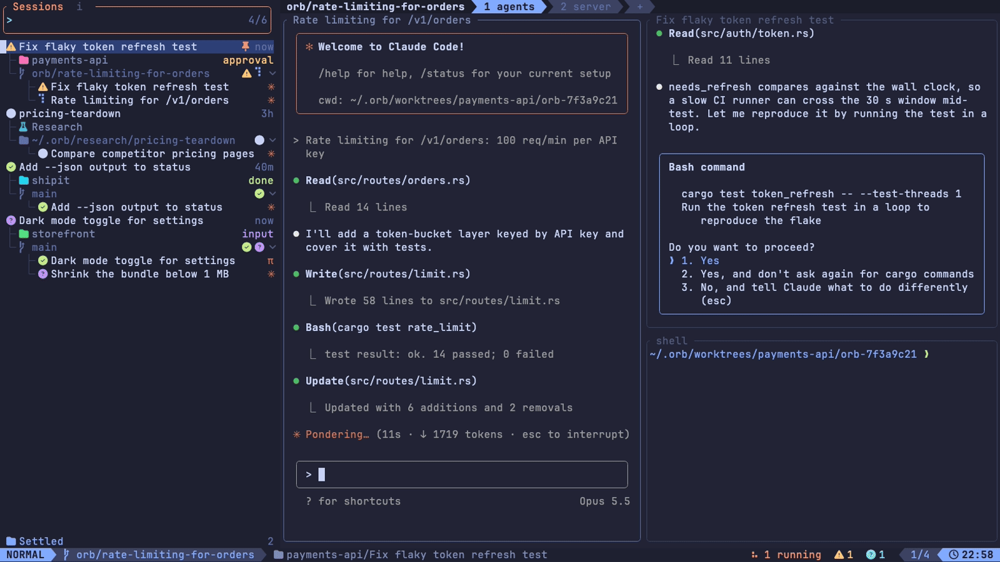

# orb

A terminal multiplexer that is mission control for your coding agents. Each session is a project checkout or git worktree holding tabs of split panes. Run [Claude Code](https://claude.com/claude-code) or pi in any pane and the sidebar shows what each agent is doing.

## Quickstart

You need macOS or Linux, a recent stable Rust toolchain, [kitty](https://sw.kovidgoyal.net/kitty/) (orb's Cmd keys come through the kitty keyboard protocol), zmx 0.8.1 or later on your `PATH`, a [Nerd Font](https://www.nerdfonts.com), and [Claude Code](https://docs.claude.com/en/docs/claude-code) or pi. Every pane runs under zmx: `brew install neurosnap/tap/zmx` on macOS, or on Linux `paru -S zmx` from the AUR (`paru -S zmx-bin` for the release build). The Claude hook needs `python3`. On macOS, [terminal-notifier](https://github.com/julienXX/terminal-notifier) is optional.

On Linux, notifications need a freedesktop notification server, which most desktops and shells run; without one, orb shows none. On niri, clicking a notification brings orb's window forward; on other compositors the click does nothing else.

```sh
cargo install --git https://github.com/felixpherry/orb --locked
orb integration install   # Claude Code hook and pi extension
orb
```

Then:

1. `<C-g> a` adds a project from a directory picker (`Tab` opens a folder, `⏎` adds it).
2. `<C-g> n` picks a project, then a workspace (the checkout, a new worktree, or a worktree the project used before) and, for a new worktree, its base branch. The session opens with one shell.
3. Type `claude` or `pi` in the shell. The pane becomes an agent row under the session's card.
4. `Cmd n` splits the pane right, `<C-g> p d` splits it down, and `<C-g> t n` opens a tab.
5. `q` in the sidebar quits orb. Every pane keeps running under zmx, and orb reattaches them when it starts again.

The Cmd keys reach orb only through kitty `map` lines in `kitty.conf`:

```
map cmd+h send_key super+h
map cmd+j send_key super+j
map cmd+k send_key super+k
map cmd+l send_key super+l
map cmd+left send_key super+left
map cmd+down send_key super+down
map cmd+up send_key super+up
map cmd+right send_key super+right
map cmd+n send_key super+n
map cmd+x send_key super+x
map cmd+plus send_key super+plus
map cmd+equal send_key super+equal
map cmd+minus send_key super+minus
map cmd+1 send_key super+1
map cmd+2 send_key super+2
map cmd+3 send_key super+3
map cmd+4 send_key super+4
map cmd+5 send_key super+5
map cmd+[ send_key super+[
map cmd+] send_key super+]
map cmd+i send_key super+i
map cmd+o send_key super+o
```

## Demo



[Watch it as an MP4](docs/demo/demo.mp4)

The demo shows, in order:

1. The sidebar and the dashboard start screen, then the which-key popup and its `+group` menu.
2. Approving a tool call and answering Claude's question, with both sessions attached at once.
3. Jumping back with `<C-o>`.
4. Search, rename and pin.
5. A Feature group: its card, folding it, and a new thread started with `n`.
6. Settling (with its `No`/`Yes` confirm), the Settled shelf, and deleting.
7. Hiding and resizing the sidebar.
8. Adding a project, and the `Initialize Git` offer for a folder that isn't a git repository.
9. Starting a session in a new worktree through the model, permission, workspace and branch pickers.
10. Lazygit, a shell and Neovim opened in that worktree.
11. Making a Feature group and a Research group, and starting the Research group's draft.
12. An Incognito session, with its `Trust /tmp/orb-incognito?` confirm.
13. The project filter (with Research and Incognito listed), removing a project, and filtering to one.

## Features

- Sessions across all your projects and git worktrees, each with tabs and splits. Every pane runs under zmx, so quitting or updating orb leaves its programs running.
- Agents you start in any pane, once `orb integration install` has run, show under their session's card with their status (working, needs approval, needs input, idle, done), their title and a mark: `✳` for Claude Code, `π` for pi.
- Settling a session, by hand or after 3 days without activity, kills every pane and moves the card to a collapsible Settled shelf. `⏎` brings the tabs and splits back and types `claude --resume` or `pi --session-id` into each agent's pane.
- A new session can get its own worktree under `~/.orb/worktrees/`, made from a freshly fetched base branch. Its `orb/<hex>` branch is renamed after the agent's title once the first turn ends. Every hour, and at start, orb prunes worktrees that nothing uses, or whose sessions were all settled at least 7 days ago, keeping their branches and skipping any with uncommitted changes. Resuming a session whose worktree was pruned recreates it on its branch.
- Research and Learn sessions (`<C-g> g r`, `<C-g> g l`) get a named folder under `~/.orb/research/` or `~/.orb/learn/`, copied from `~/.orb/templates/<kind>/`. orb writes a default template there first: for Research, a research kit with an orchestrator `AGENTS.md`, investigator, falsifier and simulator subagents, conventions, a report template and `SOURCES.md`; for Learn, a learning kit with an orchestrator `AGENTS.md`, a saboteur subagent, the storyteller, challenge, tutor and conventions files and an epub ingest script. The kits' subagents work under Claude Code and pi. Under pi they need pi's example `subagent` extension, installed once at user level (orb doesn't install it; the commands are in `docs/research.md` §20). If you use pi-amplike, that install also changes its `"npm:pi-amplike"` entry in `~/.pi/agent/settings.json` to `{"source":"npm:pi-amplike","extensions":["!extensions/subagent.ts"]}`, because amplike has its own `subagent` tool and pi won't start with both.
- `<C-g> i` opens an Incognito session in `/tmp/orb-incognito/`, for a quick question outside any project. It settles, deletes, renames and resumes like any other session.
- `/` searches session names and agent titles, settled ones included, `<C-g> f` narrows the sidebar to one project, and `<C-[>`/`<C-]>` move back and forward through a jump list. `<C-g> Space` opens a session picker, newest chat first, with a preview of each chat. `<C-g> /` searches what was said in every agent conversation, your prompts and the agents' replies, newest message first.
- Each pane keeps 10 000 lines of history for the wheel, and dragging over text copies it to the clipboard.
- When orb isn't focused, a desktop notification tells you an agent finished, needs approval or needs input. On macOS it goes through terminal-notifier, whose click brings kitty forward when kitty's remote control is on, or through `osascript` when terminal-notifier isn't installed. On Linux it goes to the desktop's notification server, and a click brings orb's window forward on niri.
- A LazyVim look: a snacks-style explorer, a lualine mode line, a helix which-key popup, vim.ui.select pickers and snacks session, worktree and search pickers, all in tokyonight-moon.

## Keys

`<C-g>` is the leader in the sidebar and in panes; press it and wait for the which-key popup. While a pane has the keys, every key goes to its program except the Cmd keys, `<C-g>`, `<C-[>` and `<C-]>`.

| Key | Action |
| --- | --- |
| `Cmd h/j/k/l`, Cmd arrows | Move focus between panes; `Cmd h` from the leftmost pane goes to the sidebar, `Cmd l` from the sidebar goes back, and `Cmd l` from the rightmost pane goes to the next tab |
| `Cmd n` | Split right |
| `Cmd x` | Close the pane |
| `Cmd +` / `Cmd =`, `Cmd -` | Grow / shrink the focused pane or the sidebar |
| `Cmd 1` to `Cmd 5` | Go to tab N |
| `Cmd [` / `Cmd ]` | Previous / next tab |
| `Cmd i` / `Cmd o` | Move the tab left / right |
| `<C-[>` / `<C-]>` | Jump back / forward through the jump list |
| `<C-g> s` | Hide or show the sidebar |
| `<C-g> p d/r/f/x/c` | In a pane: split down, split right, zoom, close, rename |
| `<C-g> t n/x/r/1-9` | Tab: new, close, rename, go to N |
| `<C-g> Space` | Session picker (`<C-s>` shows or hides settled sessions) |
| `<C-g> n` | New session |
| `<C-g> a` | Add a project |
| `<C-g> f` | In the sidebar, filter by project, with Research, Learn and Incognito right after All projects (`<C-x>` removes one) |
| `<C-g> i` | Incognito session |
| `<C-g> w` / `<C-g> b` | Workspace / branch picker (not on Incognito, Research or Learn sessions) |
| `<C-g> g r` / `<C-g> g l` | New Research / Learn session |
| `<C-g> /` | Search every prompt and reply, with the exchange around the match (`⏎` jumps to its session) |
| `<C-g> W` | Worktree picker: every worktree under `~/.orb/worktrees/`, with its size, changes, users and when the sweep will prune it (`<C-x>` deletes one, changes included, after a `No`/`Yes` confirm; the branch stays) |
| `<C-g> <C-g>` | Send Ctrl g to the focused pane |

In the sidebar:

| Key | Action |
| --- | --- |
| `j` / `k`, `gg` / `G`, `<C-d>` / `<C-u>` | Move |
| `⏎` | Focus the session's panes, resuming it if it was settled |
| `p` | Pin or unpin |
| `s` | Settle (after a `No`/`Yes` confirm) or un-settle |
| `d` | Delete the session after a `No`/`Yes` confirm: its panes are killed, transcripts stay |
| `r` | Rename the session |
| `/` or `i` | Search |
| `l` / `h` | Open / close the Settled shelf |
| `q` | Quit orb (every pane keeps running) |

`<C-[>`/`<C-]>` move through a jump list like neovim's. Moving the keys into a session's panes (`⏎`, `Cmd l` from the sidebar, a double-click on its row, or a click into a pane), `gg`/`G`, a search ended by `⏎`, a `<C-g> n` pick, and a session or search picker pick are jumps; `j`/`k` and `<C-d>`/`<C-u>` aren't. orb keeps the newest 20 rows, each at most once, across restarts. A jump selects the session and leaves the keys where they were, in its panes when pressed from a pane. It never resumes a settled session or clears the project filter.

## Mouse

orb captures the mouse from the moment it starts.

- A click selects a sidebar or picker row. A double-click, two clicks on the same row within 500 ms, acts as `⏎`.
- A click on a pane focuses it, and the click doesn't reach the pane's program.
- The wheel over a pane goes to its program if the program tracks the mouse. Otherwise it sends arrow keys on the alternate screen, and scrolls the pane's history everywhere else. History holds 10 000 lines, from what orb saw after it attached.
- A left drag in a pane whose program doesn't track the mouse (a shell, plain `claude`, plain `pi`) selects text, and the release copies it through OSC 52. A double-click selects a word and a triple-click a line. Dragging past the top or bottom edge scrolls while selecting.
- In a program that tracks the mouse, like lazygit or a fullscreen Claude, clicks and drags go to the program.
- With the keys in the sidebar, the wheel moves the selection one row. Otherwise, with no picker or rename box open, the wheel over the sidebar scrolls only its view, 3 lines a notch. Over a picker's list it moves the picker's selection, and over the session, worktree or search picker's preview it does nothing. Neither wraps.
- A click outside a picker or the rename box closes it, as `Esc` does.
- A click on the sidebar's search box starts a search, and a click in any input's text moves the cursor there.

kitty's Shift+drag still selects with kitty's own selection, past orb.

## Development

```sh
just test   # cargo test --workspace
just lint   # check, clippy -D warnings, fmt check, test-attribute guard
```

orb stores its state in `~/.orb/userdata/state.sqlite` and its transcript search index in `~/.orb/userdata/search.sqlite`, which it rebuilds when the file is missing.
